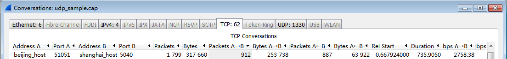
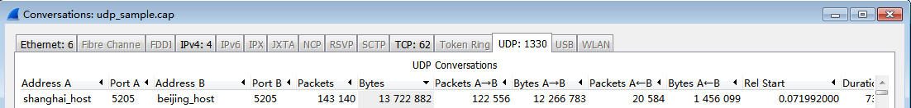
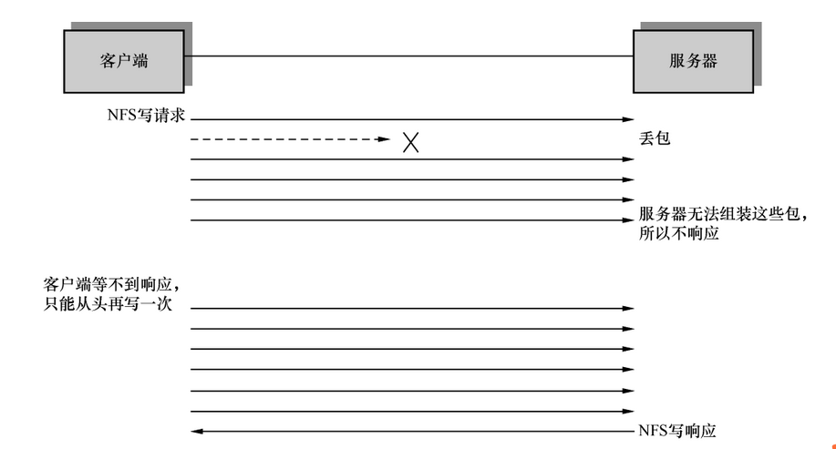
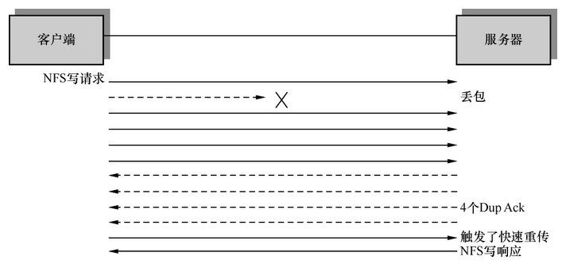

一个你本该懂的问题
==================

.. attention:: 本文的最终版本收录于 :doc:`/books/2016` 中，标题为《一个你本该能解决的问题》。

很多年来，IT公司的笔试卷中都有这样一道送分题——列举TCP和UDP的区别。我遇到的应聘者或多或少都能回答出重点，比如TCP是可靠的，而UDP是不可靠的等等。

不过我最近开始怀疑这道笔试题的价值，因为很多人似乎是靠死背硬记，完全不理解答案的真正含义；也有些人说得出其所以然，却不知道如何应用。本文要分享的案例，就涉及TCP和UDP的这个区别。

故事的背景是这样的：某公司的数据中心在上海，不过产生的数据要镜像到北京，每10分钟同步一次。项目实施时规划得很严谨，租用的带宽理论上完全满足需求。不过实施后却无法在10分钟内完成同步。实施团队驻场数周都没有解决，开始怀疑宽带的质量有问题，和网络提供商陷入了无休止的扯皮。

吵到最后，项目组决定抓一个网络包来判断，于是找到了我。我用Wireshark打开一看，发现TCP包很少，UDP包却很多，如下图所示：

   
   TCP

   
   UDP

.. note:: 上图可以通过 Wireshark->Statistics 菜单->Conversations 得到。

这说明他们在广域网中通过UDP传输大批量数据。根据我对传输层协议的理解，是不合适的。于是我粗略看了一下Wireshark的主窗口，果然发现很多下图这样的报错。

.. image:: _static/icmp.png
   :width: 350

这个报错很常见，RFC 792就有介绍：
Page 7: If a host reassembling a fragmented datagram cannot complete the reassembly due to missing fragments within its time limit, it discards the datagram, and it may send a time exceeded message. （第七页：当分片丢失而导致接收方无法完成数据报的重组时，它可以放弃该数据报并发送一个超时消息。）

也就是说，从上海发到北京的UDP数据报被分片传输了。又因为有些分片在路上丢失，导致北京一方无法完成组装，所以就出现了上图的报错。找到了原因就好办，我建议项目组把传输层协议换成TCP，这样理论上能大幅度提高性能。理由如下：

1. TCP有流控机制，能够降低网络拥塞时丢包的概率。这个细说起来太复杂，可参考《Wireshark网络分析就这么简单》的70页至79页。

2. 即便在丢包概率一样的情况下，TCP处理丢包的效率也比UDP高得多。比如某一个NFS的写请求按照MTU可能要切成6个分片。假如该NFS连接在基于UDP时丢失了一个分片，就会导致所有6个分片的重传（因为UDP不可靠，不懂得如何处理丢包），如下图所示：

而当该NFS连接基于TCP时如果也丢失一个包，则只需重传丢失的那个包即可，因为TCP是可靠的（意味着它有重传机制）。如下图所示：

本例中6个分片的情况可能还不够明显，假如一个写操作要切成50个分片，那问题就严重了，一个丢包需要50个重传来弥补。而TCP无论什么情况下都只需重传一个，效率高多了。

项目组根据建议调成TCP之后，性能果然上去了。这个问题本质上就这么简单，每一个过得了笔试的人本应该都会的。
