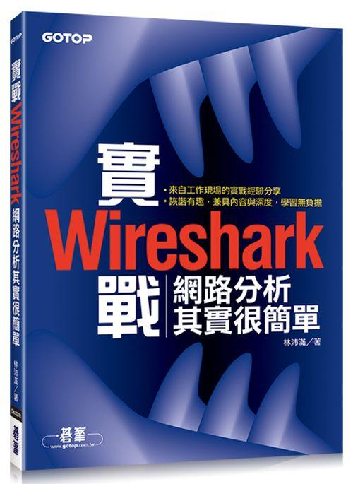

.. linpeiman documentation master file, created by
   sphinx-quickstart on Sat Dec 19 17:51:25 2015.
   You can adapt this file completely to your liking, but it should at least
   contain the root `toctree` directive.

.. _index:

林沛满书友会
============

.. attention:: 林先生新书付梓，将于近期出版，敬请关注

Who is 林沛满？
---------------
林沛满，2005年毕业于上海交通大学，现任 EMC 网络存储部门的主任工程师。多年来为多个产品团队提供过技术咨询，范围包括网络、操作系统、文件系统和域等。当林先生不在工作时，大部分时间都花在了园艺花卉上，尤其是欧洲月季。

林先生的书
----------

2014年力作《Wireshark 网络分析就这么简单》由人民邮电出版社在中国出版。

.. image:: _static/book2014.jpg
    :width: 350

2015年该作品由碁峰资讯股份有限公司在台湾以繁体中文出版。

2015年年底新作《Wirshark 网络分析的艺术》即将出版发行。全新内容，敬请期待。

What is 林沛满书友会？
----------------------
林先生是一位低调的作家和热情的技术工作者。其实在他的第一本著作《Wireshark 网络分析就这么简单》问世之前，一些热门公众号或者网站其实已经转载过他的博客作品（当然有些是未经授权咯）。

这个书友会网站获得他本人许可，阶段性目标是收集和整理多年来散落在互联网各处他的有趣文字，以饲各位朋友。

同时本网站也会提供专门栏目来发布相应书籍的购买信息和勘误表。

.. toctree::
    :titlesonly:

    books/index
    articles/index

相关信息
--------
林先生联系方式：请移步微博关注 `@林沛满 <http://weibo.com/linpeiman>`_ 以便与林先生直接联系

书友会联系方式：请创建新的 `GitHub issue <https://github.com/lextudio/linpeiman/issues>`_ 以便技术人员跟进

出版社联系方式：请联系 `人民邮电出版社 <http://www.ptpress.com.cn>`_ 或 `碁峰资讯股份有限公司 <http://www.gotop.com.tw/>`_
